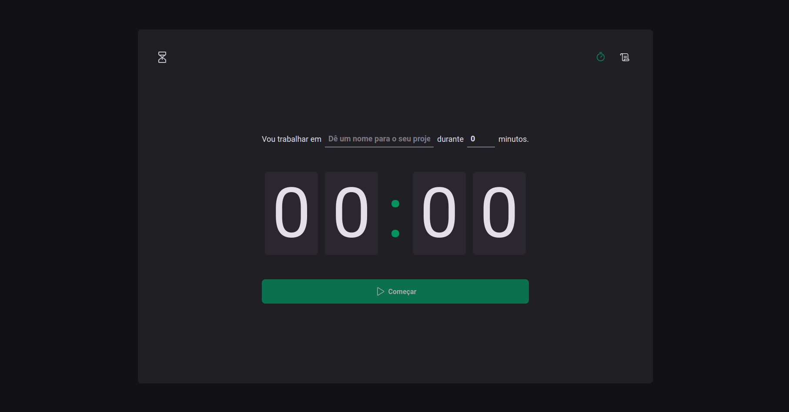
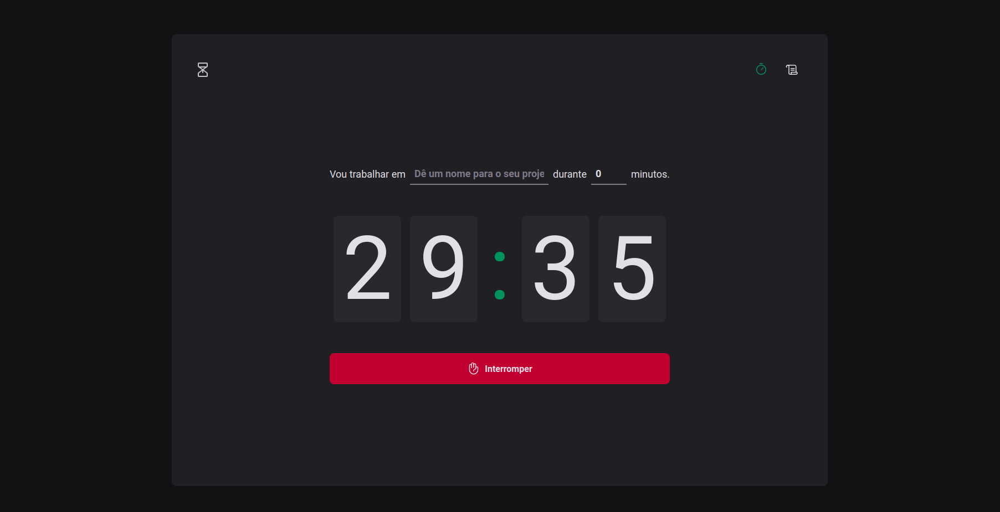
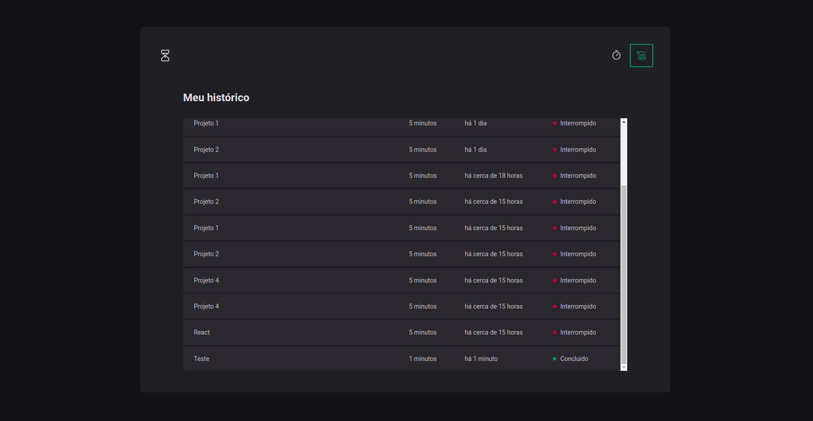

# FOCUS

## Descrição
<strong>Focus</strong> é um website desenvolvido com a finalidade do usuário estabelecer ciclos de focos, evitando assim distrações durante o seu trabalho.

## Tecnologias utilizadas

<ul>
  <li>React</li>
  <li>Typescript</li>
  <li>Styled Components</li>
  <li>React Hook Form</li>
  <li>entre outras...</li>
</ul>

<br>

## Pré-requisitos

Antes de executar a aplicação (caso queira criar sua própria versão), atente-se aos requisitos:
* Ter instalada a versão mais recente do `<Node.js e Yarn>`

<br>

## Executando o Projeto

Para acessar o projeto, basta clicar <a target="_blank" href="https://focus-ashen.vercel.app/">aqui</a>.

Agora, caso queira personalizar e criar sua própria versão, siga estas etapas:

1. Instale os pacotes<br>
```
>> yarn
```

ou <br>

```
>> npm install
```
<br>
2. Agora, é só executar os comandos:<br><br>

Para rodar a aplicação:
```
>> yarn dev
```

ou <br>

```
>> npm run dev
```

Pronto!

## PREVIEW


<br /><br />


<br /><br />


<br />
